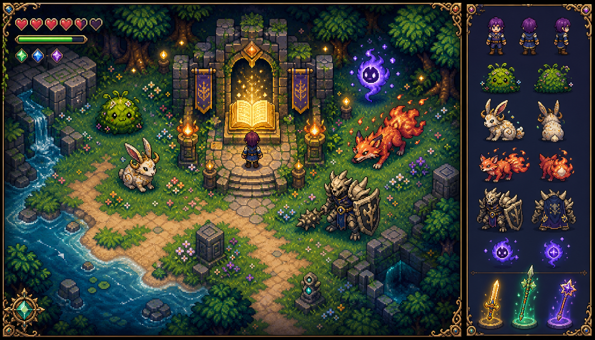

# Phantasy Codex Adventure

A compact, colorful top-down action RPG built for quick keyboard-first runs. Every world is generated from a seed, creatures have distinct temperaments, and each level adds a build-defining choice.

**Live game:** [phantasy-codex-adventure.condensed.workers.dev](https://phantasy-codex-adventure.condensed.workers.dev)



## Play

| Action | Keys |
| --- | --- |
| Move | `WASD` or arrow keys |
| Sprint | `Shift` or `Space` |
| Attack | `J`, `Z`, or `Enter` |
| Sunblade / Thornlance / Starwand | `1` / `2` / `3` |
| Character sheet | `Tab` |
| Pause | `P` or `Escape` |
| Sound | `M` |

The Sunblade sweeps a wide close-range arc, the Thornlance reaches farther and pierces, and the Starwand fires guided spell bolts. Passive mosslings and hornhares retaliate only when attacked; emberfoxes, boneguards, and wisps hunt automatically.

## Features

- Deterministic 72×72 procedural realms with water, beaches, forests, flowers, stone, ruins, and a central Codex shrine.
- Continuously replenished passive and aggressive creature populations.
- Health, stamina, sprinting, armor, critical hits, damage numbers, particles, healing drops, XP, and 99 levels.
- Three upgradable relic weapons and three-choice level-up drafts with common, rare, and mythic boons.
- Live character sheet with build stats and relic mastery.
- Daily seed and unlimited wild-world runs.
- Shared D1 leaderboard. The server validates a run session and derives level from total XP before accepting the score.
- Original generated key art plus purpose-built pixel rendering and procedural Web Audio feedback.
- One codebase shaped for Cloudflare Workers and ChatGPT Sites.

## Local development

Requirements: Node.js 22+ and npm.

```bash
npm install
npm run db:migrate:local
npm run build
npm run dev:worker
```

Open `http://localhost:8787`. `wrangler dev` serves the production assets, Worker API, and local D1 database together.

For frontend-only iteration, run `npm run dev`; Vite proxies `/api` to a Worker running separately on port `8787`.

## Validation

```bash
npm test
npm run build
npx wrangler deploy --dry-run
npx wrangler check startup
```

## Deployment

`main` is the production branch. GitHub Actions runs tests and a production build on every push and pull request. After the `CLOUDFLARE_ACCOUNT_ID` and `CLOUDFLARE_API_TOKEN` repository secrets are present, set the repository variable `CLOUDFLARE_DEPLOY_ENABLED=true`; pushes to `main` will then apply D1 migrations and deploy the Worker. The gate keeps forks and first pushes from producing a misleading secret error.

The Cloudflare deployment uses:

- Worker static assets for the Vite bundle.
- D1 binding `DB` for run sessions and leaderboard rows.
- `/api/runs/start`, `/api/runs/end`, `/api/leaderboard`, and `/api/health`.

## ChatGPT Sites

The repository includes `.openai/hosting.json` with the same `DB` D1 binding. In ChatGPT Work or the desktop app, attach this local project and ask Sites to save a version with durable game-score storage, then deploy the reviewed version. Sites adds its hosted `project_id`; it should remain the only system that writes that identifier.

Cloudflare and Sites are separate deployments sharing the same application contract. Neither deployment requires secrets in source control.

## Art

The hero, monster families, three relics, shrine, environment palette, and UI motifs were established with OpenAI image generation. The generated key art is integrated into the title screen; live gameplay uses bespoke Canvas pixel rendering so animation, tinting, damage feedback, and procedural terrain remain crisp at every viewport size.

## License

MIT
